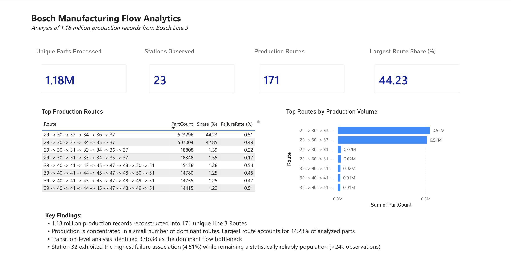
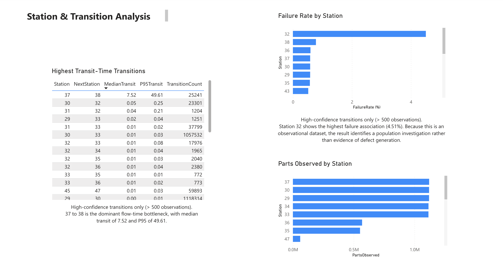
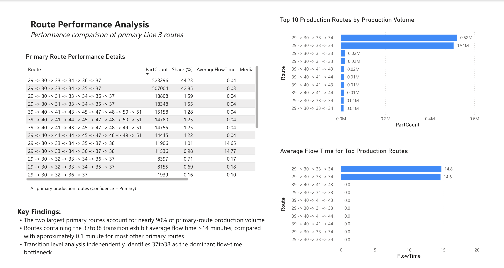
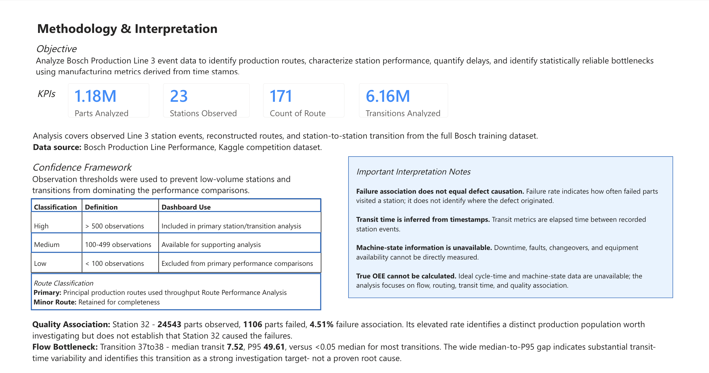

# Bosch Manufacturing Flow Analytics

An end-to-end manufacturing analytics project analyzing production flow using Python and Power BI. 

This project uses the **Bosch Production Line Performance** dataset, originally published by Bosch as part of a Kaggle competition. I used the provided production timestamps and response data to reconstruct manufacturing flow through Line 3 and analyze station-level performance, routing patterns, quality associations, and potential bottlenecks

## Data Source

**Dataset:** Bosch Production Line Performance  
**Source:** Bosch / Kaggle  
**Original Competition:** https://www.kaggle.com/c/bosch-production-line-performance

The original dataset is not redistributed in this repository. Only derived summary tables produced by the analysis are included.

## Project Overview

Using the Bosch dataset, I reconstructed station-to-station production paths from timestamp data and analyzed approximately **1.18 million parts**, **23 observed manufacturing stations**, **171 production routes**, and **6.16 million station-to-station transitions**.

The analysis was designed to answer three primary questions:

- How do parts move through Bosch Production Line 3?
- Where are the largest delays and potential flow bottlenecks?
- Which stations and production routes are associated with elevated failure rates?

## Key Findings

- **37 → 38 emerged as the dominant flow-time bottleneck**, with a median transit time of **7.52** and P95 of **49.61**, compared with median transit times below 0.05 for most transitions
- **Station 32 showed the highest failure association**, with 1,106 failed parts across 24,543 observed parts (**4.51%**), substantially above most high-volume stations. This is treated as an association rather than evidence that Station 32 causes failures
- Line 3's scope as a terminal production stage was independently validated: across 1,183,158 parts, 0% showed activity on another production line after their final Line 3 event, supporting the interpretation of Line 3 route endpoints as terminal within the available production data
- Production flow was highly concentrated: the **two largest production routes represented approximately 87% of analyzed production volume**
- The analysis identified **171 unique production routes across 23 observed stations**, demonstrating substantial routing variation despite concentration in a small number of dominant paths

## Dashboard

The interactive Power BI report is included in [`dashboard/Bosch Manufacturing Flow Analytics.pbix`](dashboard/Bosch%20Manufacturing%20Flow%20Analytics.pbix).

### Executive Summary



### Station & Transition Analysis



### Route Performance Analysis



### Methodology & Interpretations



## Tools & Technologies

- **Python:** pandas, NumPy
- **Power BI:** interactive dashboard development and data visualization
- **Power Query:** data transformation and preparation
- **Git/GitHub:** version control and project documentation

## Analysis Workflow

1. **Data Exploration** — Examined Bosch timestamp and numeric datasets to identify Line 3 station features and understand the structure of the manufacturing data
2. **Event Reconstruction** — Converted wide timestamp data into station-level production events for each part
3. **Event Validation** — Validated reconstructed Line 3 events, including station coverage, duplicate part-station observations, and timestamp consistency
4. **Flow Reconstruction** — Sequenced station visits to reconstruct station-to-station transitions and calculate transit-time metrics
5. **Station & Transition Analysis** — Evaluated production volume, failure association, route-ending behavior, transition frequency, and transit-time distributions using observation-count confidence thresholds
6. **Route Analysis** — Reconstructed unique production routes and compared route volume, flow time, and failure association
7. **Scope Validation** — Evaluated cross-line production activity to validate Line 3 as an appropriate scope for detailed manufacturing-flow analysis
8. **Power BI Visualization** — Built a four-page dashboard covering system-level findings, station and transition performance, route performance, and methodology/limitations

## Analytical Approach

Because the Bosch dataset provides production timestamps rather than direct machine-state information, station-to-station transit time was derived from the elapsed time between consecutive recorded station events.

To reduce the influence of low-volume observations, station and transition results were classified using observation-count thresholds:

| Confidence | Observations | Use |
|---|---:|---|
| High | ≥500 | Primary analysis |
| Medium | 100–499 | Supporting analysis |
| Low | <100 | Excluded from primary comparisons |

These thresholds improve the stability of comparisons but do not establish causal relationships.

## Important Limitations

- **Failure association does not imply defect causation.** A station's failure rate represents the proportion of parts visiting that station that ultimately received a failed response; it does not identify where the defect originated
- **Transit time is not equivalent to machine processing time.** It represents elapsed time between recorded station events
- Machine-state information such as downtime, maintenance, faults, and changeovers is unavailable.
- Ideal cycle-time data is unavailable, so this analysis does **not** claim to calculate true Overall Equipment Effectiveness (OEE)
- Findings such as the 37→38 transit-time anomaly identify areas for further investigation rather than confirmed root causes

## Repository Structure

```text
Bosch-Manufacturing-Flow-Analytics/
├── dashboard/
│   └── Bosch Manufacturing Flow Analytics.pbix
├── data/
│   └── processed/
│       ├── route_summary.csv
│       ├── station_summary.csv
│       └── transition_summary.csv
├── images/
│   ├── executive-summary.png
│   ├── station-transition-analysis.png
│   ├── route-performance-analysis.png
│   └── methodology.png
├── scripts/
│   ├── 01_data_exploration.py
│   ├── 02_process_line3.py
│   ├── 03_validate_line3_events.py
│   ├── 04_build_flow_metrics.py
│   ├── 05_station_analysis.py
│   ├── 06_route_analysis.py
│   └── 07_validate_line3_scope.py
└── README.md

```

## Reproducing the Analysis

The original Bosch dataset is not included in this repository. To reproduce the analysis:

1. Download `train_date.csv` and `train_numeric.csv` from the Bosch Production Line Performance competition on Kaggle.
2. Place the files in `data/raw/`.
3. Run the Python scripts in `scripts/` sequentially.

The scripts reconstruct the Line 3 event, transition, station, and route-level datasets used in the Power BI dashboard.
